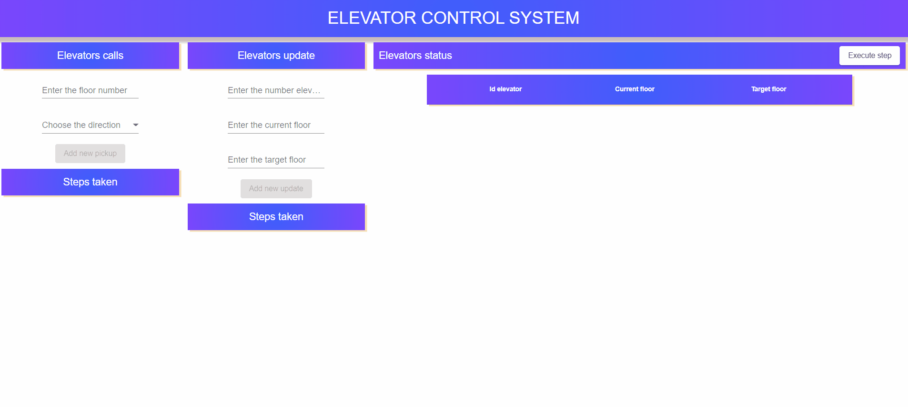

# Elevator Simulation

To change the number of elevators, go to the file `src/main/resources/application.properties`, change the parameter value `app.elevator`
## Instruction to run
<ol>
<li>Clone this repo</li>
<li>Import project to Intellij</li>
<li>Run ElevatorSimulationApplication</li>
<li>Open termial and go to the <em>web-ui</em> directory in the project</li>
<li>Run <em>npm start</em>,  <b>localhost:4200</b> will open up in your default browser</li>
</ol>

## The appearance of the application

